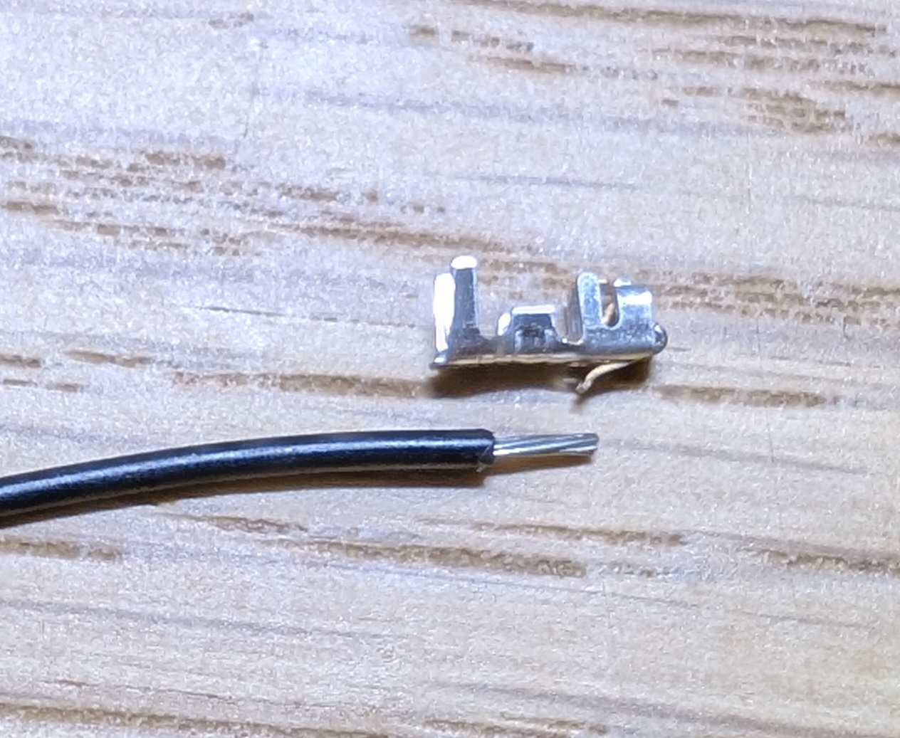
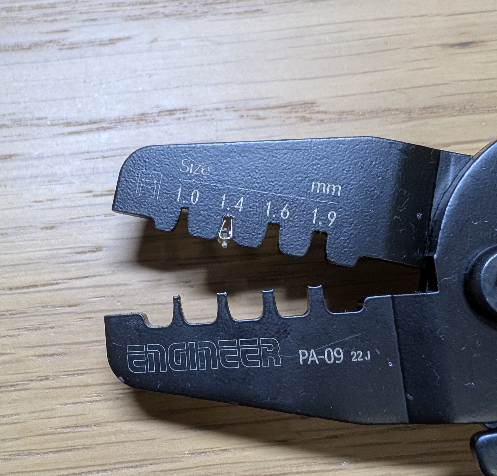
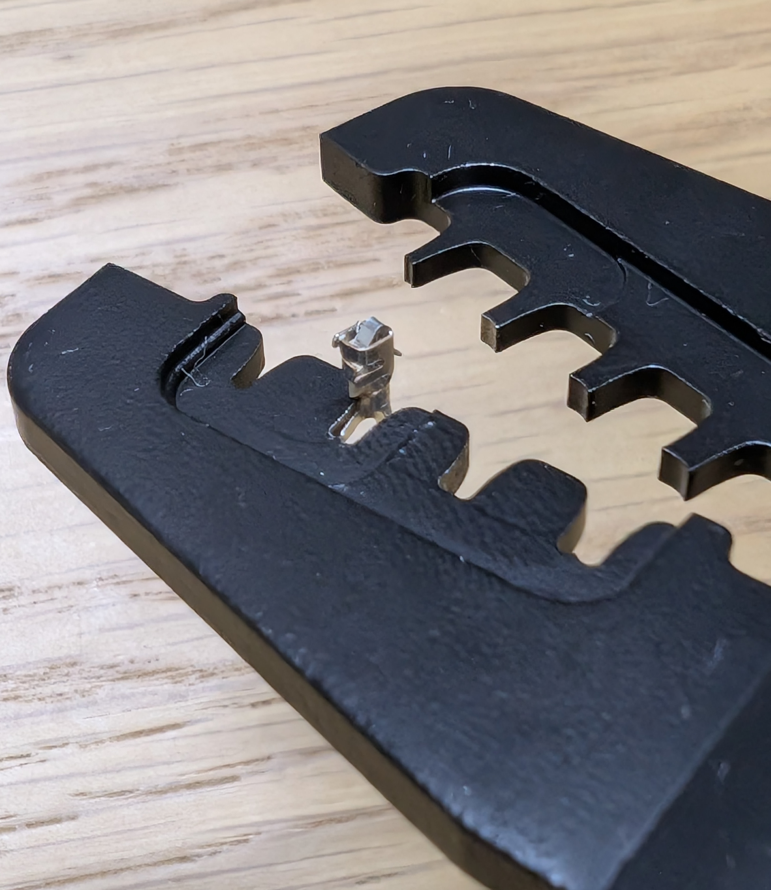
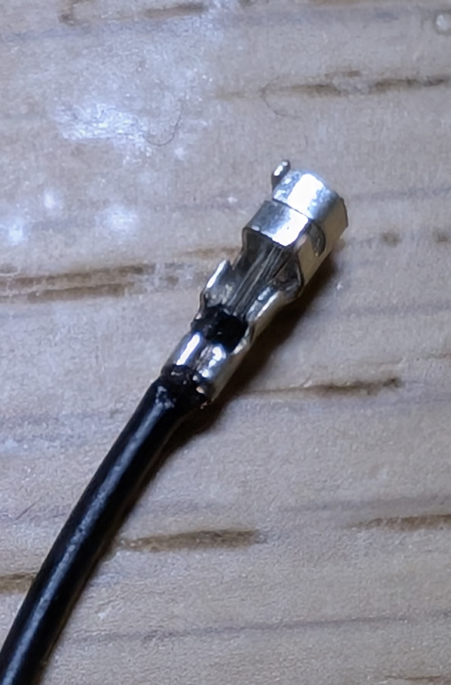
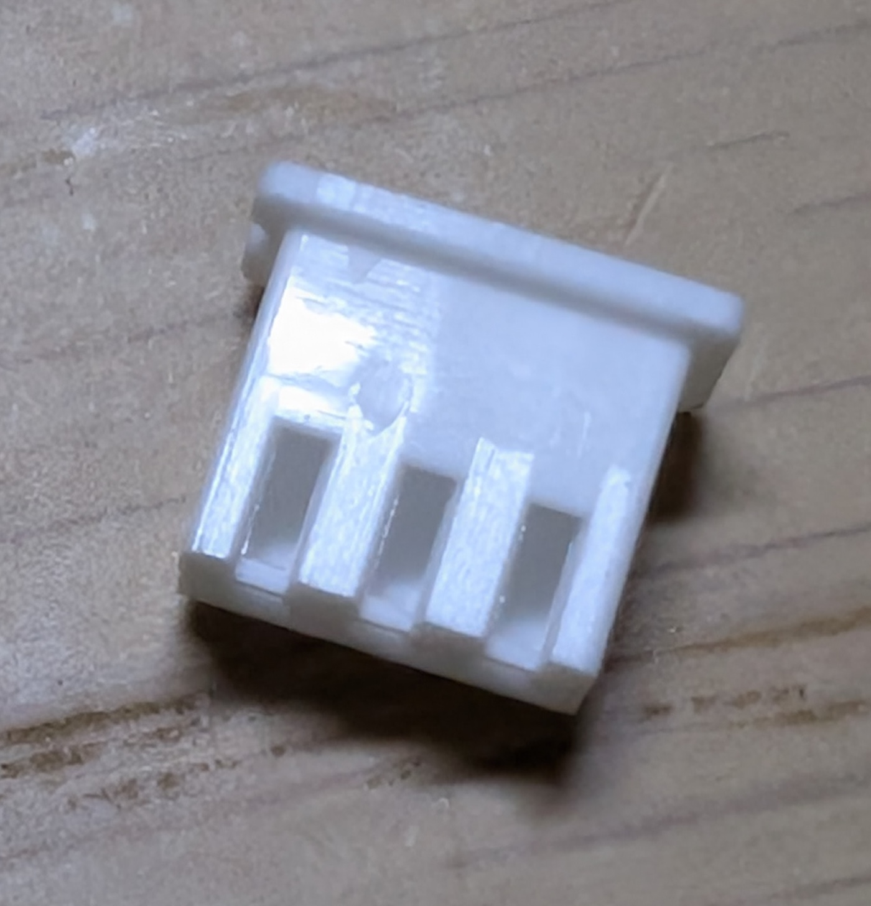
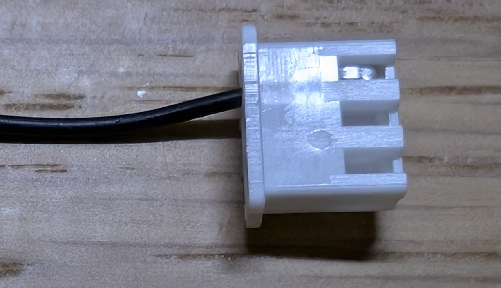

自分でケーブルを作れるようになりましょう。僕が引退したあと物理部を少し覗いたらジャンパー線がはんだ付けされていたり、そのままケーブルとして使われているのを目撃したことがありません。良くないですね。自分でケーブルぐらい作れるようにならないとメンテナンス性が下がります。

ケーブルづくり（カシメとも呼ばれる）とはただの銅線にコネクタを取り付けることで抜き差しのできるケーブルにすることです。例えば、LANケーブルも自作できるみたいです。やったことはありません。

この資料の最後におすすめのコネクタも紹介します。

### 使用するもの
ケーブルを作成するには以下のものが必要となります。

- 銅線
- ワイヤーストリッパー
- 圧着ペンチ
- コンタクト
- ハウジング

コンタクトとハウジングが良くわからない人もいると思うので、その2つについてまずは解説します。

### ハウジング
ハウジングとはケーブルの先端の樹脂の部分のことです。以下の写真はXHコネクタの3ピンのハウジングです。ハウジングの大きな穴に銅線が刺さり、オスのピンが刺さります。
### コンタクト
コンタクトとは銅線をハウジングに刺すための金具になります。ハウジングの穴に銅線をただ刺すだけでは抜けてしまいます。コンタクトには爪がついておりその爪がハウジングの溝に引っかかることで抜けないようになります。

コンタクトの側面を見てください。以下の写真ですね。左側に上方向に高い突起があり、真ん中に低い突起があります。右側は突起と言うよりは周りが1面を除いて覆われているような状態になっています。左側の突起が銅線をコンタクトの溝に沿わせて銅線を差し込んだときに、銅線が抜けないようにしっかりと押さえる部分です。左側の突起は銅線の被覆を抑える必要があります。真ん中の低い突起は被覆ではなく銅線を抑えるためのものです。ここでしっかりと銅線を抑えることで導通します。右側の箱のような部分にはピンが刺さって入るわけです。
### 手順
#### 1. 被覆を剥く
先ほど解説したコンタクの溝の真ん中の低い突起の長さ+アルファ程度被覆をむきましょう。

#### 2. 圧着ペンチにセットする
まずコンタクトを圧着ペンチにセットします。圧着ペンチには色々溝がありますがコンタクトの幅より少しきつい程度が良いと思います。キツすぎると圧着したときにコンタクトが壊れるとので注意です。圧着ペンチで先程解説した突起を潰すことで銅線を抑えます。2つある突起のうち被覆を抑える高い突起を先に圧着します。高い突起が垂直ではなく少し開いた状態になっていると思うので垂直になるよう傾きを整えてあげると圧着ペンチにセットしやすいです。セットする際には表裏の向きにも注意してください。逆でやるとうまく圧着できません。
セットできたら1で用意した銅線を差し込みます。長い突起の部分が被覆になるようにちょうどいい感じに差し込んでください。差し込めたらペンチを握りしめて圧着しましょう。次に真ん中の突起も同じ要領で圧着しましょう。この時、コンタクト背面の爪を間違えて潰さないように位置に気をつけてください。爪を潰してしまうとハウジングに刺すことができなくなってしまいます。

#### 3. ハウジングに差し込む
圧着できたらハウジングに差し込みます。ハウジングには以下の写真のような溝があるのでその溝に爪が引っかかるように向きを揃えて淹れてください。置くまで差し込んだあとに銅線を軽く引っ張って抜けなければ大丈夫です。
### コネクタに関する注意
銅線を引っ張ってコネクタを抜いている人を良く見かけますがやってはいけないことです。特に良く使われているXHコネクタはそこそこ抜くのに力が必要となるので、そのような抜き方をしてしまうと銅線にかなり負荷がかかります。必ず樹脂部分（ハウジング）を持って引っ張って抜いてください。

また、コネクタを多用するようになるとケーブルの両端の配線順のミスで、想定外の接続となってしまい、うまく動作しなかったりショートしたりしてしまうことがあります。こういったミスをなくすためにもケーブルを使う際のルールを決めておくと良いと思います。個人的に必ず守っていることを記しておきます。

- 電源ピンの位置を固定する
	- 例えば、一番左側は必ずグラウンド、+電源が必要なときは一番右側にするなど
- 銅線の両端を同じところに接続する
	- 例えば、片方のハウジングの一番右側に指した銅線をもう一方のハウジングの一番右側以外に刺すことは絶対にせず一番右側に刺す
	- 要はケーブルの中で銅線たちをクロスさせない
	- 何が良いのかと言うと、同じピン数だけど使用する場所が違うコネクタを間違えて指しても正しく機能するようになります
	
### おすすめコネクタ
ロボカップサッカーを行う上で最低限知っておくべきコネクタを2つ紹介します。

- [XHコネクタ](https://akizukidenshi.com/catalog/g/g112255/)
	- ピンピッチ（ピン同士の間隔））が2.5mmなのでユニバーサル基板に刺さる（ユニバーサル基板のピンピッチは2.54mmのハズ）
	- しっかりロックされる
		- むしろ抜きづらい
	- 定格3AまでOK
		- 5Aとかまで耐えると思います
	- 信号線にしては大きいと思う
		- 高密度基板を作るときは結構スペースを食う
- PHコネクタ
	- ピンピッチが2.0mmなので小型
	- 自然にコネクタが抜けることは無い
	
	- 信号線であればこれで十分

補足として自分で圧着することは無いけど使えるコネクタも解説します。

- リボンケーブル
	- [こういうやつ](https://akizukidenshi.com/catalog/g/g103796/)です
	- ピン数が多いので大量に信号線を共有したいときにはおすすめです
	- コネクタが結構でかいです
- Tコネクタ
	- [これ](https://akizukidenshi.com/catalog/g/g113420/)と[これ](https://akizukidenshi.com/catalog/g/g113434/)ですね
	- Li-Poで使われていると思います
	- 大電流を流すことができるので電源周りに使いましょう
		- むしろXHコネクタなどでロボットの電源を賄っていたら終わっているのでやめましょう
		- Tコネクタから来た電源をXHコネクタで複数の箇所に分けるといった使い方が良いと思います
- XTコネクタ
	- [これ](https://akizukidenshi.com/catalog/g/g117950/)などです
		- ラインナップが多いので自分で確認してみましょう
	- 注意点はTコネクタと同じです