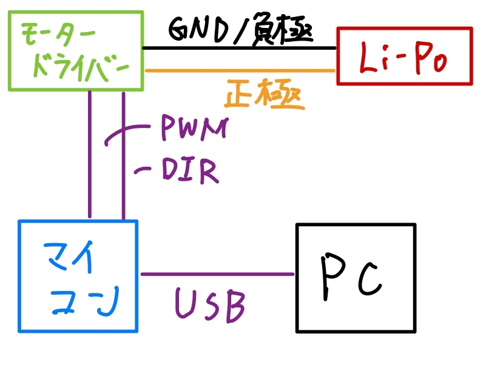

著者：根岸孝次


## 概要

このページでは、Pololu 社の [**G2ハイパワーモータードライバー**](https://www.switch-science.com/products/2661) の使い方を解説します。回路の基本的な接続方法、簡単な動作を実現するためのプログラムといった基本的なレベルから、電流制御・LAP 制御といったハイレベルまで扱いたいと思います。

## 【基本編】 G2ハイパワーモータードライバーについて

まずは、今回の解説対象の **G2ハイパワーモータードライバー** について解説します。これは、Pololu社が発売しているモータードライバーです。

モータードライバーとは低電圧・小電流領域で動作するマイコンから高電圧・大電流領域で動作するモーターを制御するための中継ぎ的役割をするモジュール・回路です。MDなどと呼ばれることもあります。詳しい解説については、[モータードライバーの解説記事](motor_driver.md)を読んでください。

[Pololu](https://www.pololu.com/)社は電子工作に有用なモジュールやアクチュエーターを販売しています。おそらく、物理部に転がっているゴツいモーター(Maxonでは無い)はPololuのギヤードモーターです。他には、様々な種類のモータードライバーや電流センサ、小型液晶モジュールなども販売しています。日本国内では、[Switch Science](https://www.switch-science.com/collections/pololu)で取り扱いがあります。

G2ハイパワーモータードライバーは、コンパクトさと高出力能力を兼ね備えた優秀なモータードライバーです。ロボカップの限られたスペースにはうってつけのモータードライバーです。物理部にDAISENの赤いモータードライバーがあるので、それとサイズを比べてみるとよく分かると思います。（ただ、DAISENのモータードライバーは4個のモーターを同時に制御できる4ch仕様であるのに対して、G2ハイパワーモータードライバーは1個のモーターだけ制御できる1ch仕様であるとい違いには注意する必要があります。）2025年1月時点では、G2ハイパワーモータードライバーには5つのラインナップがあるようです。(2ch仕様のものは省略しています。)入力定格最大電圧が最も小さいものでも18Vであり、ロボカップジュニアで仕様されている3セルのLi-Poの電圧12V程度と比べても問題なさそうです。また、最大連続電流も11A~25Aほどあります。ロボカップジュニア程度で使うモーターであれば十分なスペックです。(ちなみにNHKロボコン規模のロボットだと、日常的に100A近く流している光景を見ることができます。)ロボカップジュニアではどの種類を購入してもモータードライバーの電圧・電流制限ともに問題ないと思います。これらの中で一番安いものを替えば良いと思います。(やすいと言っても1枚あたり7000円ほどするので高いですね。個人で電子工作する場合には自作も視野に入れたくなってくる金額です。)

他にもG2ハイパワーモータードライバーには特徴があります。まず、このモータードライバーには電流センサ出力が備わっています。どういう意味かと言うとモーターに流れている電流をマイコンに教えるための機能が備わっています。CSピン(各ピンについては後述)の電圧をマイコンのデジタル入力(ADC)で測定し、CSピンの電圧を元にモーターに流れている電流を計算することが可能です。

$$
V_{CSピン} [V] = 0.05 + 0.01 \cdot I_{モーター} [A]
$$ 

以上の計算式を元にモーターに流れている電流を逆算することができます。これはホームページに書いてあったことで、検証したわけではないので、使用する場合には各係数を自分で確かめたほうがより高い精度で電流値を得られると思います。

なぜ、モーターに流れる電流を測定すると嬉しいのだろうか?それは、モーターに流れる電流の大きさとモーターが生み出すトルク(力のモーメント)の大きさは一般的に比例関係にあるからである。理想的なモーターのモデルで計算してみるとわかる。比例定数についてはモーター固有の値である。「トルク定数」などで検索してみて調べると勉強になるかも知れない。トルクが分かるとモーターが進もうとするときに発揮している力なども計算することができるので、ハイレベルな制御がしたい人には嬉しい機能。ちなみに、PWM制御ではモーターに加える電圧を変化させることで出力を替えているわけであるが、モーターの電圧とモーターの回転数は比例する。もちろん、モーターに流れる電流も電圧の増加に応じて増加する。また、モーターの回転数とトルクはトレードオフの関係にある。いつかこの辺も解説したい。

加えて、モーターに流れる最大電流を制限することも可能です。VREFピンとGNDの間に適切な抵抗を挟むことで最大電流を変えることができます。抵抗値については以下のグラフを参考にしてください。何も抵抗を接続しない場合には60Aが上限となりますが、そもそもモータードライバーの定格電流が60Aも無いのでその前に故障すると思います。

さらに、このモータードライバーの最大の特徴として、100kHzもの高周波PWM信号に対応しているということです。なんで、100kHzもの高周波数に対応していることが嬉しいかと言うと、LAP駆動が可能になるからです。細かいことは割愛しますが、LAP駆動を20kHzといった低周波PWM信号で制御してもあまりうれしくありません。LAP駆動には100kHzほどの高周波PWM信号が必要となります。ただ、100kHzもの高周波数に対応したモータードライバーが数多くあるわけではありません。例えば、DAISENの4chモータードライバーに使用されているIC(VNH5019)では、最大20kHzの対応となっています。つまり、これではLAP駆動をする意味が無いということです。(ちなみに、Pololu社もこのICを使用したモータードライバーを販売していた気がします。)実際、私が出場した時には、100kHzのPWM信号とG2ハイパワーモータードライバーでMaxonモーターを制御していました。話はズレますが、正規Arduinoやそれのコピー品といったマイコンでは100kHzものPWM信号を生成刷ることができません。[Seeeduino XIAOシリーズ](https://seeedjp.github.io/Wiki/Document_Guide/XIAO.html)や[Raspberry Pi Picoシリーズ](https://www.raspberrypi.com/products/raspberry-pi-pico/)、[STM32シリーズ](https://www.st.com/ja/microcontrollers-microprocessors/stm32-32-bit-arm-cortex-mcus.html)、[Teensyシリーズ](https://www.pjrc.com/teensy/)、([ESP32シリーズ](https://www.espressif.com/en/products/socs/esp32))などのマイコンを使用する必要があります。(ESP32については本当かどうか保証できません。)

## 【基本編】 G2ハイパワーモータードライバーの回路的なセットアップ


上の写真は、G2ハイパワーモータードライバーの各ピンの名称とその機能を解説したものです。([公式ホームページ](https://www.pololu.com/product/2994)にも同様に書いてあります。)英語ですが、高高生ならこれぐらい余裕ですね!

ここでは、重要なピンと補足で解説したいピンについて説明します。
この記事で触れなくても一通りどんなピンなのか全部把握するべきであることだけは伝えておきます。基本的に仕様しないピンはフローティング(何も接続していない状態)で良いと思います。

### 重要なピン

| ピン | 役割 |
| --- | --- |
| VIN | モーター駆動用の電源の正極を接続する。大電流が流れるので、はんだ付けなどでしっかりと接続する。商品に付属の[ターミナルブロック](https://akizukidenshi.com/catalog/g/g101306/)を利用しても良い。また、**使用するケーブルについては太いケーブルを利用すること。**(AWG20かそれより太いものをおすすめします。[AWGについて](https://www.taiyocable.com/column/3114/))
| GND(写真右上) | モーター駆動用の電源の負極を接続する。VINと同様な点に気をつけること。|
| OUTA, OUTB | モーターの2本ケーブルをそれぞれ接続する。逆に接続してもモーターは回るが制御による回転方向が逆になる。足回りのモーターで全部の回転方向が統一されていると制御する人が喜ぶので、逆かどうかチェックして確認すると良い。|
| PWM | マイコンからの制御信号を受け取るピンの1つ。このピンに入力されるPWM信号のDuty比に応じてモーターの2本の線の間に印加する電圧の大きさを変える。PWMの仕組みについては[信号について](signal.md)や[PWM制御](https://dotstud.io/docs/pulse-width-modulation/)を参考にすること。($V_{モーター} = V_{VINピン} \cdot \frac{[\text{Duty比}] [\%]}{100}$)|
| DIR | マイコンから制御信号を受け取るピンの1つ。このピンに入力されるデジタル信号の論理状態(Low or High)に応じて回転方向を変化させる。正回転と逆回転の向きの定義は君たち次第。Low・Highと正回転・逆回転の対応関係はモーターの2本のケーブルのつなぎ方を変えることにも依存するので、自分で動かして確認することが手っ取り早い。|
| GND(写真左上) | 制御信号を送るマイコンのGNDと接続するためのピン。**必ずマイコンのGNDと接続する。** |

#### 重要な補足

<span style="color: red;">以下に重要なことを補足しておきます。これは絶対に読んでください。</span>わかりにくい場合には、配線例のイメージが下の方に掲載されているので、それを参考にしながら考えると良いかも知れません。

高3の電磁気を終えるとわかるが、電圧というのは2地点の電位の差を表している。一般的な回路では、GNDを0Vとして、各点とGNDとの電位差を電圧としている。ゆえに、0Vの基準が変われば各ピンの電圧も変化する。したがって、各回路部品（マイコンやセンサ、その他ICなど）では0Vの基準つまりGNDを共有している必要がある。GNDが上手く共有されていない部分があると正常な動作をしないことがよくある。時には動くんだけど、動かないときもあるみたいなじょうきょうが発生しがち。ロボットの回路を組む際にはすべての部品のGNDピンが何かしらの経路と接続されている必要がある。導線で接続されていればすべてのGNDの電位が等しいことが保証される。(間に抵抗とか挟むことは想定していない。)要するに、どのGNDのピンも導線の経路を辿っていくことでバッテリーの負極にたどり着けば良い。(ただし、アイソレータやフォトカプラなどを用いた絶縁回路についてはその限りではない。[キッカーの記事](kicker.md)を参照すると良いかも知れない。)

ここまで読めば、なぜこのモータードライバーにGNDピンが2つあるのかわかるだろう。画像右上のGNDピンのお陰でモータードライバーのICはモーター用電源の0Vがわかる。これにより、高電圧電源電圧が正しく分かる。そして、画像左上のGNDピンのお陰で制御マイコンがわの0Vがわかる。これにより、制御信号の電圧が正しく分かる。また、モータードライバーの内部でこれら2つのGNDピンは接続されているので、それぞれのGNDピンを通して、制御マイコンの0Vとモーター用電源の0Vを揃えることになる。

ロジック(マイコン)側とパワー(モーター)側のGND、つまり0Vを揃えることの意義をもう少しだけ解説する。もし、パワー側の電源(だいたいの場合Li-Po)を降圧することで3.3V(5V)電源を生成し、これによりセンサやマイコンに電源を供給していた場合、ロジック側とパワー側のGNDはモータードライバーを介さなくても接続されていることになる。つまり、モータードライバーのGNDピンのどちらか一方を接続しなくてもおそらく上手く動作するだろう。(<span style="color: red">パワー側のGNDを接続しないことは絶対に行わないこと。ロジック側に大電流が流れて故障する恐れがある。</span>両方接続しないのは論外。正しく動かない。)もちろん、両方つないでおいても全く問題ない。寧ろ両方つなぐことが好ましい。

それでは、もし、パワー側の電源にはLi-Poを用いて、マイコン側の電源にはパソコンのUSBから供給していた場合どうなるだろうか?両者のGNDはつながっていないのは明らかであるので、何かしらの方法でそれらをつなげてやる必要がある。例えば適当な導線やジャンパー線でGNDピンをつなぐのでも構わない。普段から制御用のPWM,DIRピンに加えてGNDピンもつないでおけばこのような問題は起こらない。これがモータードライバーに2つGNDピンがある理由である。

### 基本的な接続の仕方

以上の注意点を踏まえた上で、いくつか配線例を掲載しておきます。良い例と悪い例の両方を掲載しておくので、上述の注意点を理解する際の参考にすると良いと思います。

#### 良い例

- 降圧回路を利用せず、モーター用の電源とは別の電源からマイコンに電源供給する場合。


- 降圧回路を利用して、モーター用の電源からマイコンに電源供給する場合。

    - 当たり前だけど、Li-Poの電源をそのままマイコンに供給したら壊れるので、ちゃんと降圧すること。

#### 悪い例

- 降圧回路を利用せず、モーター用の電源とは別の電源からマイコンに電源供給する場合。

    - モータードライバーとマイコンのGNDが接続されていない点がよろしくない。
- 降圧回路を利用して、モーター用の電源からマイコンに電源供給する場合。

    - 実はこれでも動作するので、良い例の場合よりも配線量が減る。ただ、あまり良くない。
    - モータードライバーとマイコンのGNDが接続されていない点がよろしくない。
- 降圧回路を利用して、モーター用の電源からマイコンに電源供給する場合。

    - これも理論上は動く。**これについては本当によろしくない。**
    - モータードライバーのGNDとLi-PoのGNDが直接接続されていないので、モーターに流れた電流がマイコンや降圧回路を経由してLi-Poに戻って来ることになる。ただ、マイコン周りのGNDは大電流が流れることが想定されていないので、配線や基板が燃えたり、発熱する。多分壊れる。

### 追加で解説したいピン

| ピン | 役割 |
| --- | --- |
| 3V3 (out) | モーター用電源を降圧して生成される3.3V電源が出力されているピン。おそらくモータードライバーのICで必要となるので生成されている。この電源を使用すれば、モータードライバーに接続する外部回路で3.3Vがほしいときにわざわざ自分で降圧しなくて済む。**ただし、他の3.3V電源をこのピンに接続することは絶対に行っていけない。** 回路の知識に自身がない場合は使わないことをおすすめする。動作確認用のLEDなどをつけておくと便利かもしれない。マイコンなどを接続するのは電流の面で厳しいかも知れない。|
| CS | 先述したモーターに流れる電流を知るためのピン。このピンの電圧からモーターに流れる電流を逆算できる。|
| VREF | 先述した最大電流を制限するためのピン。このピンとGNDとの間に適切な抵抗を接続することで最大電流を変えることができる。あまり必要性が私にはわからない。|

以上がG2ハイパワーモータードライバーで重要となるピンの解説である。実際の配線はその時の状況に依ると思うので割愛する。わからなければ、私にまで聞いてほしい。(メインページに連絡先はあります。)

## 【基本編】 G2ハイパワーモータードライバーを用いたモーター制御

とりあえず一般的なPWM制御を行うプログラムを解説します。

### 前提

使用するピンはPWMピンとDIRピンの2つです。

- PWMピン
    - モーターの2本の線にかける電圧を調整する。詳細を知りたい場合には、PWM制御について調べてみてください。
- DIRピン
    - モーターの2本の線に流れる電流の向きを変える。つまり、回転方向を変えることができる。

| モータードライバーのピン | マイコン上・制御上のピン名 | 具体例(Arduino) |
| --- | --- | --- |
| PWMピン | PWM_PIN | D7 |
| DIRピン | DIR_PIN | D8 |
    一般的にPWMを出力可能なピンは限られています。どのピンが使用可能なのか事前に調べましょう。基本的なPWM制御では、DIRピンについては、PWM信号を利用しないので、どのピンでも大丈夫です。

### サンプルプログラム

各関数の役割やC++の使い方については解説しません。

以下のサンプルプログラムは、

1. 正回転で2秒ごとに加速していく。(5段階で計10秒。)
2. 逆回転で2秒ごとに加速していく。(5段階で計10秒。)
3. 3秒間停止。

を繰り返すプログラムです。動作確認できたら、プログラムをいじって色々な動きを試してみると面白いと思います。

```c++
#include <Arduino.h>

int PWM_PIN = D7;
int DIR_PIN = D8;

void setup() {
    // シリアル通信の開始。
    // このサンプルプログラムではシリアル通信を利用する訳では無いが、
    // デバッグではよく利用すると思うので、とりあえず通信を開始しておくと良い。
    Serial.begin(9600);

    // 各ピンのモード設定。
    pinMode(PWM_PIN, OUTPUT);
    pinMode(DIR_PIN, OUTPUT);

    // 基本的にピンの出力は0Vにしておくと安心。
    analogWrite(PWM_PIN, 0);
    digitalWrite(DIR_PIN, LOW);

    // 電源を入れてすぐにモーターが回り始めると危険なので3秒ぐらい待機。
    delay(3000);
}

void loop() {
    // とりあえず正回転させる。
    // ここでは、DIR_PINがLOWの状態を正回転としている。
    digitalWrite(DIR_PIN, LOW);

    for (int i = 1; i < 6; i++) {
        // duty比は0~255なので、とりあえず、5段階で2秒ごとに速度を上げていく。
        int duty = 255 * i / 5;
        analogWrite(PWM_PIN, duty);
        delay(2000);
    }

    // 逆回転させる。
    // ここでは、DIR_PINがLOWの状態を逆回転としている。
    digitalWrite(DIR_PIN, LOW);

    for (int i = 1; i < 6; i++) {
        // duty比は0~255なので、とりあえず、5段階で2秒ごとに速度を上げていく。
        int duty = 255 * i / 5;
        analogWrite(PWM_PIN, duty);
        delay(2000);
    }

    // 停止させる。
    analogWrite(PWM_PIN, 0);
    delay(3000);
}
```

## 【応用編】 G2ハイパワーモータードライバーを用いたLAP制御

普通の制御ができたらLAP制御にも取り組んでみると面白いかも知れません。
LAP制御の詳しいことについてはここでは解説しません。[モータードライバーの解説資料](motor_driver.md)や[Yunit tech blog](https://yunit.techblog.jp/archives/75097444.html)、[メカトロニクスにうってつけの日](https://tattatatakemori.hatenablog.com/entry/2017/07/20/232827)を読んでみると思います。

### 前提

使用するピンはPWMピンとDIRピンの2つです。

- PWMピン
    - **本来は**モーターの2本の線にかける電圧を調整する。詳細を知りたい場合には、PWM制御について調べてみてください。
    - LAP制御では、PWMピンにPWM信号を入力することはありません。常にHIGHの状態、つまり最大出力の状態にしておきます。
- DIRピン
    - **本来は**モーターの2本の線に流れる電流の向きを変える。つまり、回転方向を変えることができる。
    - LAP制御では、DIRピンに高周波PWM信号(~100kHz)を入力します。
    - Duty比が50%の時、正回転と逆回転が半分半分となるので、我々にはモーターが回転していないように見えます。
    - Duty比が50%からズレることで、正回転と逆回転のバランスが崩れるので、モーターが正回転もしくは逆回転するようになります。

| モータードライバーのピン | マイコン上・制御上のピン名 | 具体例(Arduino) |
| --- | --- | --- |
| PWMピン | PWM_PIN | D7 |
| DIRピン | DIR_PIN | D8 |
    一般的にPWMを出力可能なピンは限られています。どのピンが使用可能なのか事前に調べましょう。基本的なLAP制御では、DIRピンだけにPWM信号を入力するのでPWMピンをPWMに対応していないマイコンのピンに接続しても問題はありません。ただ、動作確認などをする際には、普通の制御をまずするべきなので、PWMピントDIRピンの両方にPWM対応したマイコンのピンをつなげるのが安牌です。

```c++
#include <Arduino.h>

int PWM_PIN = D7;
int DIR_PIN = D8;

int MAX_PWM_FREQ = 100000; // 100kHz

void setup() {
    // シリアル通信の開始。
    // このサンプルプログラムではシリアル通信を利用する訳では無いが、
    // デバッグではよく利用すると思うので、とりあえず通信を開始しておくと良い。
    Serial.begin(9600);

    // 各ピンのモード設定。
    pinMode(PWM_PIN, OUTPUT);
    pinMode(DIR_PIN, OUTPUT);

    // PWM周波数を変更する。
    // PWM周波数を変更する方法については、マイコンによって異なる場合があります。
    // Arduinoフレームワークで変更に対応していないマイコンも存在します。
    // 適切な方法については各自調べることをおすすめします。
    analogWriteFrequency(MAX_PWM_FREQ);

    // 基本的にピンの出力は0Vにしておくと安心。
    digitalWrite(PWM_PIN, LOW);
    analoglWrite(DIR_PIN, 0);

    // 電源を入れてすぐにモーターが回り始めると危険なので3秒ぐらい待機。
    delay(3000);

    // PWMピンをHIGHにする。
    // DIRピンのDuty比を50%にする。
    digitalWrite(PWM_PIN, HIGH);
    analoglWrite(DIR_PIN, 127);
}

void loop() {
    // PWM_PINがLOWだと回らないのでちゃんとHIGHにしておく。
    digitalWrite(PWM_PIN, HIGH)

    // とりあえず正回転させる。
    // ここでは、DIR_PINが50%以下の状態を正回転としている。
    for (int i = 1; i < 6; i++) {
        // duty比は0~127なので、とりあえず、5段階で2秒ごとに速度を上げていく。
        // duty比が0に近いほどモーターの回転は速いことに注意。
        int duty = 127 - 127 * i / 5;
        analogWrite(DIR_PIN, duty);
        delay(2000);
    }

    // 逆回転させる。
    // ここでは、DIR_PINが50%以上の状態を逆回転としている。
    for (int i = 1; i < 6; i++) {
        // duty比は127~255なので、とりあえず、5段階で2秒ごとに速度を上げていく。
        // duty比が0に近いほどモーターの回転は速いことに注意。
        int duty = 127 + 127 * i / 5;
        analogWrite(DIR_PIN, duty);
        delay(2000);
    }

    // 停止させる方法1。
    // 見かけの停止状態であり、モーターには電流が流れ続けているので好ましい状態ではない。
    analogWrite(DIR_PIN, 127);
    delay(3000);

    // 停止される方法2。
    // ちゃんとした停止状態。モーターに電流は流れない。
    // 再度モーターを動かすときには、PWM_PINをHIGHにすることを忘れないように。
    digitalWrite(PWM_PIN, LOW);
}
```

LAP制御は、普通の制御と比べて、大きな電流が定常的に流れ続けます。したがって、バッテリーの消耗も激しいですし、モーターの発熱も大きくなります。モーターに使用されているネオジム磁石は非常に熱に弱い磁石です。発熱によって磁石が劣化するとモーターの性能が下がってしまうので、モーターの発熱には気を使って使用する必要があります。また、Maxonモーターは内部構造が他の一般的なモーターの内部構造と異なっていて、熱に弱い作りになっています。Maxonモーターを利用する場合には発熱に最新の注意を払ってください。

## 【応用編】 G2ハイパワーモータードライバーを用いた電流(トルク)制御


