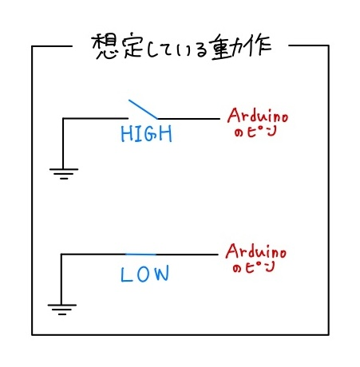
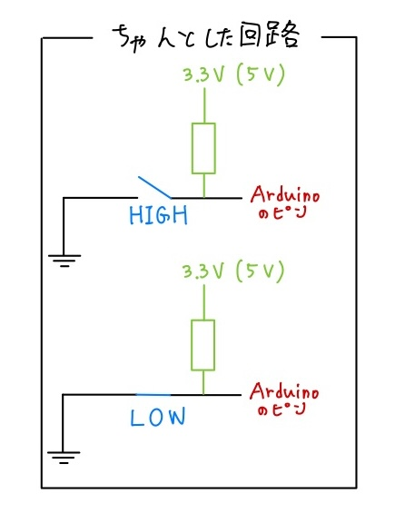

著者：根岸孝次

Arduinoにはたくさんのピンがあります。センサやアクチュエータ（モーターなど）を動かす際に、ジャンパー線を使って配線をしたと思います。この資料では、Arduinoが線を介してセンサやアクチュエータとやり取りしてい信号線について解説します

## デジタル信号
Arduinoであれば、HIGHとLOWで表現される2値の信号です。（一般的には0,1で表現します。）**グラウンドから見て**対象のピンので電圧が一定以上であればHIGH(1)、一定以下であればLOW(0)となります。HIGHが何Vかはマイコンの動作電圧に依存します。

| 動作電圧 | LOW電圧 | HIGH電圧   |
| ---- | ----: | -------- |
| 3.3V |    0V | **3.3V** |
| 5V   |    0V | **5.0V** |

マイコンの動作電圧によってHIGH電圧が異なるので、もし**動作電圧が異なるマイコン同士で通信する際には、電圧変換（レベル変換）する必要があります。** 3.3Vマイコンから5Vマイコンへの通信は問題なくできますが、5Vマイコンから3.3Vマイコンへ通信を行うと3.3Vマイコン側の許容電圧を越えて故障する可能性があるためです。マイコンによっては、動作電圧は3.3Vだけれども5V信号を入力しても良いピンが存在します。**5Vトレラント**と呼びます。

物理部にある主要なマイコンについても記しておきます。保証はしません。

- 動作電圧5V
	- Arduino Uno Rev
	- Arduino Micro
	- Arduino Mini Pro
	- Arduino Mega
	- Arduino Mega Pro
- 動作電圧3.3V
	- M5Stack
	- OpenMV
	- Seeeduino XIAO 無印
	- Seeeduino XIAO RP2040/RP2350
	- Seeeduino XIAO ESP32
	- ESP32
	- Teensy 4.0/4.1
	- STM32 (多くのピンが5Vトレラント)

### digitalWrite
デジタル出力について解説していきます。要はArduinoピンから1を出力することです。センサに情報を送ったり、LEDに電源を供給してあげるために利用します。（Arduinoピンからは最大でも100mA程度しか供給できないので、アクチュエータを動かしてはいけません。壊れます。）

Arduinoではデジタル出力のためにdigitalWrite関数が用意されています。2つの引数を取ります。返り値はありません。1つ目がピン番号(D2, A1など)で2つ目が状態(HIGH or LOW)です。非常にシンプルです。どのピンがどのピン番号に対応しているかはボードに刻印されていたりネットに記してあるのでそれを参照してください。ArduinoではデフォルトではLOWになっています。

練習としてLチカ（LEDをチカチカと点滅させること）をやってみてください。
### digitalRead
先ほどデジタル出力を学んだので、次は入力について学んでいきます。他のマイコンやセンサからのデジタル信号の状態を読み取るために使用します。

Arduinoではデジタル入力のためにdigitalRead関数が用意されています。1つの引数、ピン番号を取ります。返り値としてピンの状態を返します。読み取ったピンの状態がLOWであれば0、HIGHであれば1を返します。

練習としてボタンが押されたかどうか確認するプログラム（補足を参照すると良い）をやボタンが押されたらLEDが光るプログラムを作ってみると良いと思います。

#### 補足 プルアップ・プルダウン抵抗について
先程のdigitalReadの中で、ボタンを使ってみると良いと述べましたが、1つ注意点があります。注意点と言いながら回路を作っていくうえで非常に重要な事項です。

先ほどからHIGH、LOWと述べていますが、HIGH、LOWの基準はもちろん電圧の高低によります。ここで、電圧というものを考えてみる必要があります。ある点aの電圧Vaを計測するには電圧の基準点が必要となります。各点には電位があり、その差を普段電圧として呼んでいます。回路を扱う上で電圧を利用する際には、常に**基準点がどこにあるか**を意識する必要があります。一般的に、基準点の言及がない場合にはグランドが基準となります。だからこそ、回路を作るうえで**すべてのグランドを繋いであげることが重要**になります。例えば、回路図上に点a,bがあったとします。この時、点aの電圧として、Va(グランドから見たaの電圧),Vab(bから見たaの電圧)が考えられます。基本的にはVa≠Vabとなります。

結構大事なことを書いたと書いた本人も今思っているところですが、残念ながらこれはあくまでも前置きです。このことを理解した上でボタンとArduinoをつなぐ回路を考えていきます。

ボタンの仕組みから確認しましょう。基本的にボタンは4つのピンで構成されていて、内部的に2つのピンが接続されています。つまり、実質は2つのピンしかないということになります。ボタンを押していない状態ではこの2つのピンは接続されていません。ボタンを押すとこの2つのピンが接続された状態になります。単純ですね。ボタンを押した時にピンがグランドと接続されてLOWになる接続方法とピンが3.3Vと接続されてHIGHになる接続方法の2種類があります。両方扱うとつかれて死んでしまうので前者を扱うことにします。

ボタンを押したらLOW、押していないときはHIGHとなればいいわけです。おそらく皆さんが考える回路はこんな感じなんではないでしょうか？

残念ながらみなさんが想定しているようには動作してくれません。正確に言えば動作するときもあれば動作しないときもあるでしょう。実際には以下のように回路を作って上げる必要があります。

2つの違いは、Arduinoのピンと電源の間に抵抗が入っている点です。回路図をみるとピンを上に引っ張っているように見えます。これを**プルアップ抵抗**と呼びます。なぜこれが必要になるかと言うと、前者の場合、ボタンを押していない状態ではピンがどこにも接続されていません。この状態でdigitalReadを行うと、Arduinoはピンの電圧を測ろうとしても測る対象がないので測ることができません。（正確に言うとピンがどこにも接続されていない浮いている状態であるのでピンの電位が決まらず電圧が求まらないということです。）したがって、ボタンを押している状態がHIGHになるとは限らないのです。そこで、抵抗を挟んで電源と繋いであげて無理やりHIGHの状態にしてあげます。ボタンを押せば、ピンとグラウンドがショートするので当然LOWになります。ピンをグラウンド側と抵抗を介して接続してあげることを**プルダウン抵抗**と呼びます。ボタンを押した時にHIGHになってほしい時にはプルダウン抵抗を用います。一般的に、10k~100kΩを利用します。

わざわざ抵抗を挟むのは実は面倒だったりします。抵抗を入れ忘れた状態で発注してしまったりすることも多々あります。でも大丈夫です。一般的なマイコンには内部的にプルアップ抵抗が用意されています。pinMode関数を利用してそれらを利用したり利用しなかったり選択することができます。pinMode関数は2つの引数を取ります。1つ目にピン番号、2つ目にピンの設定を与えます。ピンの設定の例を以下の表に示しておきます。

| 設定           | 説明                              |
| ------------ | ------------------------------- |
| OUTPUT       | 出力モード、digitalWriteを利用するピンの場合に使う |
| INPUT        | 入力モード、digitalReadを利用するピンの場合に使う  |
| INPUT_PULLUP | INPUTと基本的には同じ、内部的にプルアップされる      |

## アナログ信号
次にアナログ信号を扱っていきましょう。世の中デジタルな社会ですが全部デジタルだと困るので、アナログ信号も扱います。

### アナログ入力
アナログ入力では、ピンに入力されている電圧を測定することができます。Arduinoでは、analogRead関数を利用します。引数は1つでピン番号を与えます。返り値として読み取った電圧を0~1023に変換した値を返します。0~1023の1024(10bit)段階に分割されているので正確にはアナログではありませんが真のアナログ入力を扱うことはできないので諦めましょう。デジタルのときと同様にマイコンの動作電圧によって、1023が5Vに対応するのか3.3Vに対応するのかが変わってくるので各自確認してください。

一部のマイコンでは10bitよりも更に細かく分割することもできます。STM32やSeeeduno XIAO系はその代表例です。setup()関数内で、analogReadResolution関数を利用すると細かさを変えることができます。引数は1つで、ビット数を指定します。何もしないと10bitが指定されますが、これらのマイコンは12bitでのアナログ入力にも対応しています。

アナログ入力を測定するためにADC(Analog Digital Converter)というハードウェアを利用しています。暇な時に調べてみると良いかもしれません。

### アナログ出力
アナログ入力が真のアナログ入力ではないように、アナログ出力も実は、デジタル信号を擬似的にアナログにしているだけです。そこで、使う信号がPWM信号というものです。PWM信号では、一定時間内で、HIGHになっている時間の割合、**Duty比**を変化させることで擬似的にアナログな電圧を生成します。例えば、マイコンの電源電圧が3.3Vで、Duty比が50%であれば1.65V、80%であれば2.64Vとなります。実際には、Duty比は0~100%で指定するのではなく、0~255(8bit)でしています。アナログ入力と同様で性能の高いマイコンでは、更に高分解能な設定も可能です。

一定時間内が細かいほうがよりアナログに近い波形を得ることができます。（若干嘘だけど許して。）そこで、PWM信号を生成するに当たってはDuty比に加えて、周波数が重要になってきます。 例えば、ArduinoのPWM信号はデフォルトで490/980Hzとなっています。

実際にPWM信号を出力するには、analogWrite関数を利用します。引数は2つあり、1つ目の引数にピン番号(※1)を、2つ目の引数にDuty比を0~255で表したものを与えます。Duty比の分解能を変更するには、analogWriteResolution関数を利用します。引数は1つで、Duty比の分解能のビット数を指定します。また、analogWriteFrequency関数を利用して、PWM信号の周波数を変更できます。引数は1つで、設定したい周波数を与えます。(※2)

また、真のアナログ信号を出力するハードウェアとしてDAC(Digital Analog Converter)というものがあります。ロボカップで使うことは少ないので割愛しますが、気になる人は調べたり聞いてみてください。

	※1: PWM信号を出力することが可能なピンは限られているので、使用するボード事に調べる必要があります。
	※2: PWM信号の分解能(Duty比のビット数)と周波数はトレードオフの関係にあります。設定できる上限値はマイコンの性能にかなり左右されるので、素人がいじるには少しむずかしいかもしれません。いじる場合には、それらが可能な組み合わせなのかしっかりと調べる必要があります。詳しく知りたかったら聞いて下さい。
