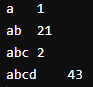

# 1.Hello, World!
<div align="center">
    <a href="../../"><button>top</button></a>
    <a href="../2.変数の宣言と型"><button>2.変数の宣言と型</button></a>
</div>

著者：佐藤弘基

# はじめに
まず、ここではC言語とC++の言語としての機能を解説する。基本的にはC言語を基準にした書き方で説明をしていく。Arduinoなどで実行して出力を確認できる`Serial.println()`などの関数ではなく、C言語の標準的な出力をする関数`printf()`を用いることにする。デバッグの環境はプラットフォーム毎に差異のある書き方はしないので、
- C/C++をコンパイルして実行できる環境を構築する
- [Atcoder](https://atcoder.jp/)のコードテストや[tutorialspoint.com](https://www.tutorialspoint.com/compile_cpp_online.php)などのオンライン上でコンパイルして実行できるWebサイトを利用する  
- `printf()`を`Serial.println()`や`Serial.print()`に置き換えて、Arduinoで実行する

などして、実際にプログラムを実行し内容を変更するなどすることを推奨する。

また、ここで説明するのはArduinoなどの組み込み開発でよく用いられる機能が中心である。そのため、メモリの動的確保やオブジェクト指向などはあまり詳しくは説明しない。

# この表示がページのタイトルで
ページの概要が主に書いてある
## この表示がされている部分がセクションのタイトルで、
ここがそのセクションの内容である。
### なお、この表示がされている部分は余談のタイトルで
この余談の内容に属する部分はあまり真剣によまなくてよい

# Hello, World!
ここでは、簡単なプログラムを実行し、C/C++の基本的な文法を説明する
## プログラムの実行
では、まずは一番簡単なプログラムを実行してみよう。
``` cpp
#include <stdio.h>

int main() {
    printf("Hello, World!\n");

    return 0;
}
```

これを実行してみると、
``` sh
Hello, World!
```
と表示される。試しに、`printf("Hello, World!\n");`を変更して、この文字列が出力されていることを確認してみよう。

文字列の最後の`\n`は改行コードを表している。例えば、`, `を`\n`に置き換えてみれば、
``` sh
Hello
World!
```
と表示されるはずだ。
### `￥`と`＼`
Windowsで開発している場合は、環境によって`\`が`￥`とも`＼`とも表示されているかもしれないが、内部的には同じ文字なので気にしないよい(わかりやすくするために全角で2つは書いているがプログラムで使えるのは半角の方だけと思っておいた方がよい)。詳しくは、ASCIIコードと`\`について調べるとよい。
### `\t`
他にもこのようなコードはあって、これの次によく使われるのが`\t`だ。これはTabを表すコードで、例えば、
```cpp
#include <stdio.h>

int main() {
    printf("a\t1\n");
    printf("ab\t21\n");
    printf("abc\t2\n");
    printf("abcd\t43\n");
}
```
を実行すると、  
  
といった結果が得られる。このようにある程度まで、文字を整列して表示することができる。


## `;`について
では、プログラムの説明に入ろう。まず、C/C++では`;`(セミコロン)で命令文を区切る。ここでいう命令文とは、`printf("Hello, World!\n")`と`return 0`のことだ。他の部分については後で説明するので、今は気にしないでほしい(`int main()`は関数、`#inlclude`はライブラリの読み込み(プリプロセッサ)で扱う)。

実は、スペースや改行はC言語では意味をなさないので、最低限の単語の区切りが表現されていれば、以下のようなコードでも実は正常に動作する。
``` cpp
#include <stdio.h>
int main(){printf("Hello, World!\n");return 0;}
```
ただし、`#include <stdio.h>`はプリプロセッサといって、実はC/C++の命令文そのものではなく別の決まりで処理されるので、この改行を消すとエラーが出てしまう。

実際には見ずらいのでこのような書き方をする人はいないし、私も推奨はしない。サンプルコードで改行やタブが用いられているのは、単純に見やすくするためである。自分でそろえるのが大変だという場合は、自動整形機能を積極的に活用しよう。Arduino IDEを含む大半の開発環境に入っている(使い方は自分で調べよう)。

### パラダイム
C/C++のように、命令文を1つずつ書いていってプログラムを書く言語を手続き型言語という。これが一番コンピュータ内部で実際に行われる処理に近い。この手続き型言語以外にも、関数型言語やオブジェクト指向言語などがある。とはいっても、最近はこれらの機能を複合的に持っていることが大半で、あまり明確な区分はされない。例えば、C++は長年仕様が拡張された結果、先ほど挙げた3つの言語としても書き方ができるようになっている。このプログラムの書き方をパラダイムといい、複数のパラダイムの書き方ができることをマルチパラダイムプログラミング言語という。


# Arduinoとの差異
Arduinoで実行する際に困る場合があると思うので、普通のC言語との差異を最初に説明しておく。(最初だから当然だが)説明していない用語や機能があるので、わからない場合はある程度まで読み進めてからこちらを読むとよい。詳細な動作やArduino固有の関数などについては、[Arduinoの公式リファレンス](https://docs.arduino.cc/language-reference/)を参照するとよい。[有志の日本語訳](https://garretlab.web.fc2.com/arduino.cc/www/reference/ja/language/)があるので、そちらを利用してもよい。以下の解説もそれに基づいている。

## `int main()`関数と `void setup()`関数と`void loop()`関数
C言語では普通`int main()`関数を実行するようにできている。しかし、Arduinoでは`int main()`関数ではなく、`void setup()`関数と`void loop()`関数が実行される。この動作は、以下と等しいと考えてもらってよい。
``` cpp
void setup() {
    // セットアップ用の処理
}

void loop() {
    // 繰り返し行われる処理
}

int main() {
    setup();

    while true {
        loop();
    }
}

```
このように定義された`setup()`関数が最初に一度実行された後、`loop()`関数がwhileループでずっと実行され続ける。この際、`loop()`関数を毎回呼び出していることになるので実は、
``` cpp
void setup() { // loop()の方に以下を書いてもよい
    // セットアップ用の処理

    while true {
        // 繰り返し行われる処理
    }
}
```
と書くか、
``` cpp
void setup() {
    // セットアップ用の処理
}

void loop() {
    while true {
        // 繰り返し行われる処理
    }
}
```
と書いてしまった方が速くなる。

## `Serial.println()`と`Serial.print()`
本ドキュメントでは、`printf()`を使用している。これは、主にC言語で一般的に標準出力をする際に用いられる関数だ。しかし、ArduinoにはOSがないのでこの標準出力をする先がない。そこで、一般的にArduinoでは、`Serial.println()`といった関数が代わりに用いられる。これは、シリアルポート(UARTやUSARTとも呼ばれる)に文字(ASCIIテキスト)を改行付きで送信する関数である。基本的にはこのシリアルポートで送られた信号をシリアルモニタで受け取って表示することができる。シリアルモニタはArduino IDEに標準で搭載されているし(虫眼鏡のアイコン)、他の開発環境でも該当する機能は存在している。

`Serial.println()`の他に`Serial.print()`もある。`ln`がlineの略で、これが名前についている関数は大体最後に改行を出力し、ない場合は出力しない。これもそうなっていて、
``` sh
12345
```
と出力したい場合は、
``` cpp
loop() {
    for(int i = 1; i<6; i++) {
        Serial.print(i);
    }
}
```
と出力すると、間に改行を挟まずに出力することができる。
### `printf`の`f`について
`Serial.print()`などは、引数を一個しか持たない。どういうことかというと、`printf("%d %d\n", a, b)`のように変数を同時に出力するといったことはできないということである。実は、`printf`の`f`がフォーマット(format)の略で、このように文字列の一部を変数に置き換える処理のことをこの場合は指す。つまり、普通に文字を出力するだけの関数としては、`Serial.print()`の方が標準的なのである。また、上のfor文でやっているように、文字列以外にも数(unsigned intやfloat、doubleも含む)の変数をそのままいれて出力することができる。

<div align="center">
    <a href="../../"><button>top</button></a>
    <a href="./2.変数の宣言と型"><button>2.変数の宣言と型</button></a>
</div>
