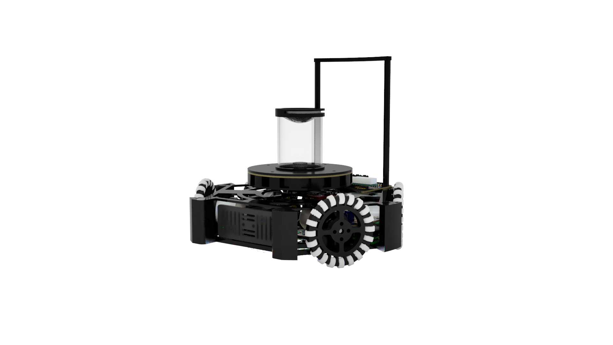

# ハードウェア開発 虎の巻
## 概要
ハードウェア開発はソフトウェア開発に比べかなりのリソースを要します。予算、時間、人員あらゆる面で大きな負担となることが多々あります。また、個人開発を行うハードルが極めて高いという面もあります。普通高校である高高ででハードウェア開発（特にロボカップ）を行うことは非常に負担となります。人によっては成績や睡眠時間を犠牲にせざるを得ないかもしれません。本ドキュメントでは可能な限りみんなの負担を減らすために、ハードウェア開発に必要となる知識や知見をまとめたものです。

ハードウェア開発を行うに当たって必要となる基礎的な知識やロボカップで強い機体を作るために必要な知識を中心にまとめてあります。随時更新していく予定です。

本ドキュメントのを使用するに当たり必ず[ラインセンス](license.md)を理解してください。

## 資料一覧
### 機械
- 鋭意執筆中

### 回路
- [電子工作をするに当たって](Circuits/before_developing.md)
- [デジタル信号とアナログ信号](Circuits/signal.md)
- [マイコンのすゝめ](Circuits/microcomputer.md)
- [通信方式のすゝめ](Circuits/transmission.md)
- [自作ケーブルのすゝめ](Circuits/make_cable.md)
- [モータードライバ解説](Circuits/motor_driver.md)
- [ボールセンサ解説](Circuits/ball_sensor.md)
- [ラインセンサ解説](Circuits/line_sensor.md)
- [IMU解説](Circuits/imu.md)
- [キッカー解説](Circuits/kicker.md)

### 制御
#### プログラム入門
- [C言語という言語について](Program-intro/about_c.md)
- [Hello World!](Program-intro/hello_world.md)
- [変数の宣言と型](Program-intro/variables_type.md)
- [演算子とは](Program-intro/operator.md)
- [関数とは](Program-intro/function.md)
- [配列とは](Program-intro/array.md)
- [構造体とは](Program-intro/structure.md)
- [ポインタとは](Program-intro/pointer.md)
- [動的メモリ確保について](Program-intro/dynamic_memory.md)
- [ライブラリの読み込みについて](Program-intro/library.md)
- [ビット読み込みについて](Program-intro/bit_operator.md)
- [オブジェクト指向概説](Program-intro/object_programing.md)
- [継承について](Program-intro/inheritance.md)
- [時代は継承より合成](Program-intro/composition.md)

## 執筆者
本ドキュメントを作成するにあたり執筆したメンバーの紹介を軽くしておきます。

### [根岸孝次](https://x.com/negi_robo)
- ロボカップジュニア ライトウェイトでハードウェアとソフトウェア開発を担当した。
    - 2021年（高1）のときのロボット
        - 足回りに**ブラシレスモーター**という特殊なものを使用したので、回路の開発にかなり苦労した。ただ、ブラシレスモーター用のモータードライバーの自作の経験でかなりの技術を手に入れたと自負している。
        - CADにもあまり慣れていなくてかなり終わっている設計である。
        - 2月の群馬ブロックのあとに作り始めて4月の大会に挑むという無謀なスケジュールだった。
        - 佐藤くん、斎藤くんと開発した。
    - 2022年（高2）のときのロボット
        - 前年のものに比べかなり進化した。世界大会進出（ライトウェイトだと上位3位ぐらいかな）を目指して、勝てるような機体を作った。
        - 足回りには高価なMaxonモーターを使用した。強かった。
        - 全国10位ぐらいだった気がする。自分で言うのは何だがライトウェイトはチーム数が多いのでそこそこの上位であり、群馬勢としては異例中の異例。
        - 大会中にキーパー機が壊れてしまったために試合に負けてしまったのがかなり痛手だった。あれがなければ...
        - モータードライバー以外自作している。
        - 筐体にペリテックのカーボンファイバー配合樹脂に対応した3Dプリンターを使用していて、強度もあり軽い。
        - 気が向いたら機体解説の資料も作りたいが本体が分解されているのでできないかも。
        - 物理部に転がっている一部の基板とかセンサーはこれの遺物である。
- 回路開発が中心で、機械設計やプログラミングもする。
- 大学ではRoboTechというサークルで機械屋をやっている。ロボットの設計と加工、組み立てを担当している。
- 回路は家で個人開発できるという理由で、サークルでは機械屋を選択。CNCや旋盤、フライス盤などを使って色々加工できてハッピーな今日このごろ。
- 本ドキュメントでは機械・回路の資料を担当
- [Twitter(旧X)アカウント](https://x.com/negi_robo)
- [Zenn(ブログみたいなやつ)](https://zenn.dev/negi_robo)
- 連絡先：[nkoji.personal@gmail.com](<mailto:nkoji.personal@gmail.com>)

### 佐藤弘樹

### 斎藤孝介
