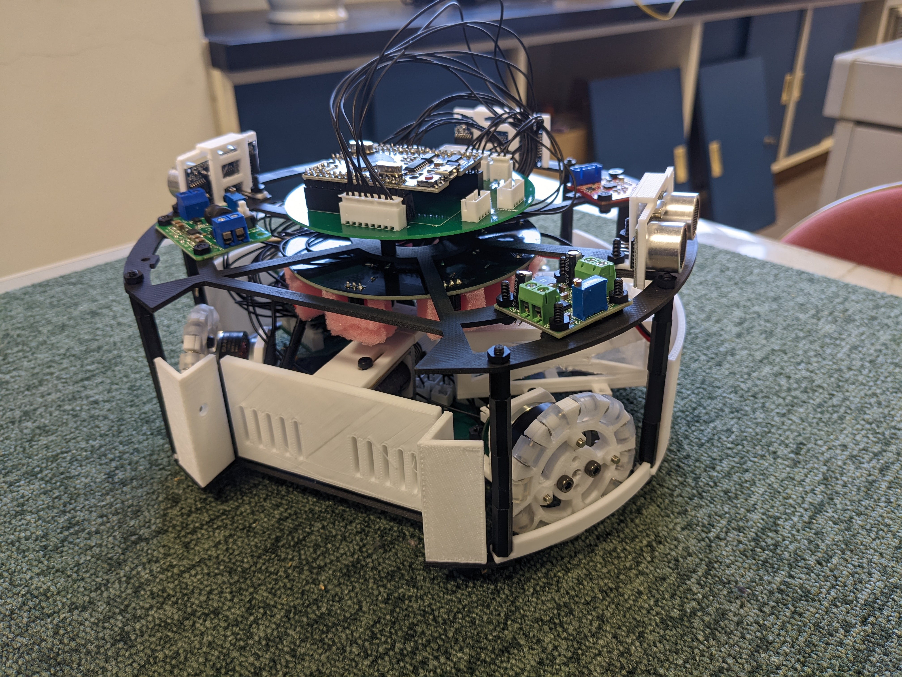
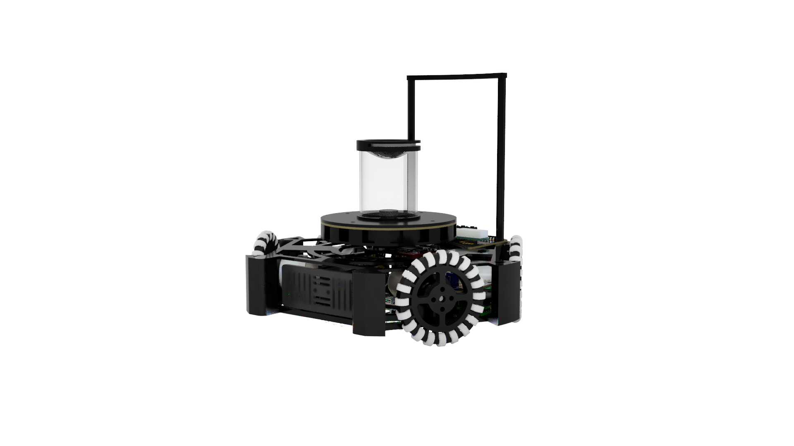

# ハードウェア開発資料

## 概要

ハードウェア開発はソフトウェア開発に比べかなりのリソースを要します。予算、時間、人員あらゆる面で大きな負担となることが多々あります。また、個人開発を行うハードルが極めて高いという面もあります。普通高校である高高ででハードウェア開発（特にロボカップ）を行うことは非常に負担となります。人によっては成績や睡眠時間を犠牲にせざるを得ないかもしれません。本ドキュメントでは可能な限りみんなの負担を減らすために、ハードウェア開発に必要となる知識や知見をまとめたものです。

ハードウェア開発を行うに当たって必要となる基礎的な知識やロボカップで強い機体を作るために必要な知識を中心にまとめてあります。随時更新していく予定です。

本ドキュメントのを使用するに当たり必ず[ラインセンス](license.md)を理解してください。

## 資料一覧

### 機械

- 鋭意執筆中

### 回路

- [電子工作をするに当たって](Circuits/before_developing.md)
- [デジタル信号とアナログ信号](Circuits/signal.md)
- [マイコンのすゝめ](Circuits/microcomputer.md)
- [通信方式のすゝめ](Circuits/transmission.md)
- [自作ケーブルのすゝめ](Circuits/make_cable.md)
- [モータードライバ解説](Circuits/motor_driver.md)
- [ボールセンサ解説](Circuits/ball_sensor.md)
- [ラインセンサ解説](Circuits/line_sensor.md)
- [IMU 解説](Circuits/imu.md)
- [キッカー解説](Circuits/kicker.md)

### 制御

- 鋭意執筆中

### C/C++入門(補助資料として軽く読んでみるといいかもしれない)

- 現在執筆中
- [1. Hello_World](Program-intro/1.Hello_World.md)

## 執筆者

本ドキュメントを作成するにあたり執筆したメンバーの紹介を軽くしておきます。

### [根岸孝次](https://x.com/negi_robo)

- ロボカップジュニア ライトウェイトでハードウェアとソフトウェア開発を担当した。
  - 2021 年（高 1）のときのロボット
    - 足回りに**ブラシレスモーター**という特殊なものを使用したので、回路の開発にかなり苦労した。ただ、ブラシレスモーター用のモータードライバーの自作の経験でかなりの技術を手に入れたと自負している。
    - CAD にもあまり慣れていなくてかなり終わっている設計である。
    - 2 月の群馬ブロックのあとに作り始めて 4 月の大会に挑むという無謀なスケジュールだった。
    - 佐藤くん、斎藤くんと開発した。
  - 2022 年（高 2）のときのロボット
    - 前年のものに比べかなり進化した。世界大会進出（ライトウェイトだと上位 3 位ぐらいかな）を目指して、勝てるような機体を作った。
    - 足回りには高価な Maxon モーターを使用した。強かった。
    - 全国 10 位ぐらいだった気がする。自分で言うのは何だがライトウェイトはチーム数が多いのでそこそこの上位であり、群馬勢としては異例中の異例。
    - 大会中にキーパー機が壊れてしまったために試合に負けてしまったのがかなり痛手だった。あれがなければ...
    - モータードライバー以外自作している。
    - 筐体にペリテックのカーボンファイバー配合樹脂に対応した 3D プリンターを使用していて、強度もあり軽い。
    - 気が向いたら機体解説の資料も作りたいが本体が分解されているのでできないかも。
    - 物理部に転がっている一部の基板とかセンサーはこれの遺物である。
- 回路開発が中心で、機械設計やプログラミングもする。
- 大学では RoboTech というサークルで機械屋をやっている。ロボットの設計と加工、組み立てを担当している。
- 回路は家で個人開発できるという理由で、サークルでは機械屋を選択。CNC や旋盤、フライス盤などを使って色々加工できてハッピーな今日このごろ。
- 本ドキュメントでは機械・回路の資料を担当
- [Twitter(旧 X)アカウント](https://x.com/negi_robo)
- [Zenn(ブログみたいなやつ)](https://zenn.dev/negi_robo)
- 連絡先：[nkoji.personal@gmail.com](mailto:nkoji.personal@gmail.com)

### 佐藤弘基

- ロボカップジュニア ライトウェイトでで主にソフトウェア開発を担当した。
  - 2021 年（高 2）の時にソフトウェアを担当
  - Arduino への書き込みに毎回チップを抜き差しする必要があってとても苦労した
  - プログラミングはこのロボの前の年に、自分で部室にあった「やさしい C」を読んで始めた
    - そのため、初めてのプログラミング言語は C 言語である
    - Python を最初にやるかもしれないが、個人的には先に C 言語やった方が後々楽だと思っている
  - 当時のプログラムは、[このリポジトリ](https://github.com/Sanzentyo/Takataka_programs_2022)にある
    - クラスを使いたいと思ったら参考になるかもしれない
- 現在は、主に Rust で[3D Gaussian Splatting](https://github.com/graphdeco-inria/gaussian-splatting)の再現実装をしている。
  - Rust はとても素晴らしい言語なので、ある程度 C/C++をやった後にやってみることをとてもおすすめする
    - Rust は C/C++を置き換えるために開発された言語で、実行速度を C/C++レベルまで保ちつつ、GC(ガベージコレクション)なしの強固なメモリ管理システムを搭載している
    - 組み込みだと過剰な部分があるといえばあるので、モダンな言語で組み込みをやりたいってだけならば zig でもいいかもしれない
  - 他言語のベストプラクティスを言語の仕様に落とし込んでいるようなものなので、Rust を一回やってみるだけでも他言語でのコードの表現力がとても上がる
- 本ドキュメントでは C/C++入門を担当
- 連絡先：[sanzen.tyo@gmail.com](mailto:sanzen.tyo@gmail.com)

### 斎藤孝介
